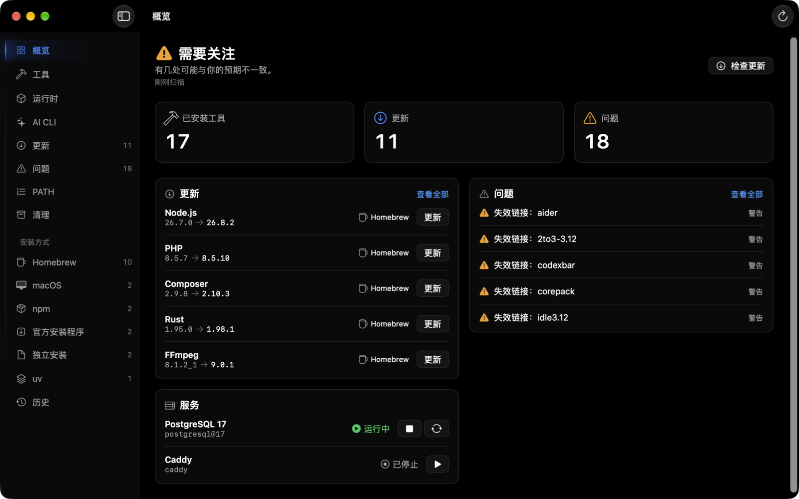

# CLI State

**看清终端实际运行的是哪一个命令。**

[](https://github.com/gentpan/CLIState/releases/latest)
[](https://github.com/gentpan/CLIState/actions/workflows/ci.yml)
[](project.yml)
[](LICENSE)

[English](README.en.md) · [下载最新版](https://github.com/gentpan/CLIState/releases/latest) · [官网](https://clistate.com) · [反馈问题](https://github.com/gentpan/CLIState/issues/new/choose)

CLI State 是一款开源的原生 macOS 应用，将命令的 **PATH 解析结果、安装来源、版本、冲突和更新** 放在同一个界面。它支持 Homebrew、npm、uv、pipx、pnpm、Cargo 和部分官方安装器；无法确认归属的工具保持只读。



## 能做什么

- **找到生效的命令**：按 PATH 顺序查看每个可执行文件的匹配项、生效版本与被遮蔽的副本，并识别 Shell 别名和函数。
- **解释安装来源**：展示 Homebrew、npm、uv 等来源的证据与可信度，区分同名工具的不同安装副本。
- **发现问题并安全维护**：检查失效链接、PATH 冲突和可用更新；更新、卸载与清理前预览命令和影响，完成后重新扫描。
- **浏览与回顾环境**：查看概览图表、版本变更历史和精选工具；可导出安装清单或配置文件，供迁移时逐项核对。

## 下载安装

**Homebrew（推荐）**

```bash
brew tap gentpan/tap
brew install --cask gentpan/tap/clistate
```

使用完整的 cask 名称只信任 CLI State，无需信任整个 tap。详见 [Homebrew 的 Tap Trust 说明](https://docs.brew.sh/Tap-Trust)。

**手动下载**

1. 从 [Releases](https://github.com/gentpan/CLIState/releases/latest) 下载 `CLIState-<版本>.zip`（已签名并经 Apple 公证）。
2. 解压后把 `CLIState.app` 拖进"应用程序"文件夹。

之后的版本会在 App 内自动提示更新，也可以在 设置 › 关于 里手动检查。

系统要求：macOS 15 或更高版本，支持 Apple Silicon 与 Intel。

## 支持的来源

| 来源 | 发现 | 检查更新 | 更新 | 卸载 | 服务 | 清理 |
|---|---|---|---|---|---|---|
| Homebrew（formula / 带命令的 cask） | ✓ | ✓ | ✓ | ✓ | ✓ | ✓ |
| npm 全局包 | ✓ | ✓ | ✓ | ✓ | — | ✓ |
| uv tools | ✓ | ✓ | ✓ | ✓ | — | ✓ |
| pnpm 全局包 | ✓ | ✓ | ✓ | ✓ | — | ✓ |
| pipx | ✓ | — | ✓ | ✓ | — | — |
| Cargo | ✓ | ✓ | ✓ | ✓ | — | — |
| 官方安装器（Claude Code 等） | ✓ | ✓ | ✓ | — | — | — |
| nvm / fnm / Volta / mise / asdf / rustup / Bun | ✓ | — | 只读 | — | — | — |
| 系统程序 / 独立安装 | ✓ | — | 只读 | — | — | 失效链接 |

## 安全与隐私

- 从不执行 `sudo`，从不修改 Shell 配置文件。
- 所有外部命令都以独立参数执行，从不拼接 Shell 字符串。
- 读取操作不会修改任何东西；写操作要求归属已确认，并经过你的确认。后台自动更新只对你明确开启的工具生效。
- 从不执行来源不明的程序来探测版本。
- 本地优先：无账号、无遥测、无云同步；不读取 Shell 历史，不扫描项目代码；环境变量只在内存中使用。

## 常见问题

**版本信息从哪里来？** CLI State 不维护自己的软件包数据库，而是询问各包管理器的官方源：Homebrew（formulae.brew.sh）、npm（registry.npmjs.org）、PyPI、crates.io 等。你为 npm、Homebrew、uv 配置的镜像同样生效。

**需要每天手动更新吗？** 不需要。CLI State 打开期间会定时检查（默认每 3 小时，检查前先刷新 Homebrew 软件包信息），默认只提醒；只有你设为"自动"的工具才会每天在设定时间后台更新一次，而且默认跳过大版本。

**CLI State 自己怎么更新？** App 内置 Sparkle 更新机制，优先从官方更新服务器获取新版本，GitHub Releases 作为备用线路，并校验签名后才安装。

## 反馈问题

- 遇到 Bug 或识别不准确：[提交 Bug](https://github.com/gentpan/CLIState/issues/new?template=bug_report.yml)。
- 想要新功能或支持新的包管理器：[提交建议](https://github.com/gentpan/CLIState/issues/new?template=feature_request.yml)。
- 附上诊断包能帮助定位问题：设置 › 关于 › 导出诊断包…。诊断包会把主目录替换成 `~`、抹掉账户名，不含环境变量和命令输出；上传前你也可以自行查看内容。
- 安全问题请不要公开提交，使用本仓库的 [Security › Report a vulnerability](https://github.com/gentpan/CLIState/security/advisories/new)。

## 从源码构建

需要 macOS 15 或更高版本、Xcode、Swift 6 和 [XcodeGen](https://github.com/yonaskolb/XcodeGen)。

```bash
brew install xcodegen
swift test --package-path Packages/CLIStateKit
xcodegen generate
xcodebuild -project CLIState.xcodeproj -scheme CLIState -derivedDataPath build build
```

更多开发约定见 [CONTRIBUTING.md](CONTRIBUTING.md)。生成的 `CLIState.xcodeproj` 不提交。

---

© 2026 GiantAccel, LLC. 源码采用 MIT License；随附字体沿用各自目录中的 SIL Open Font License。
